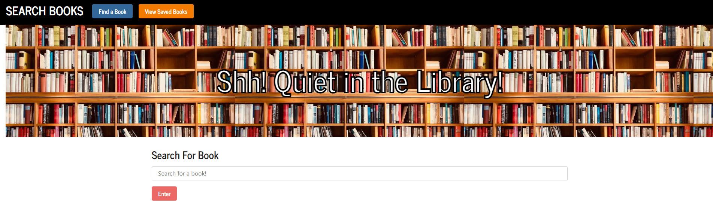
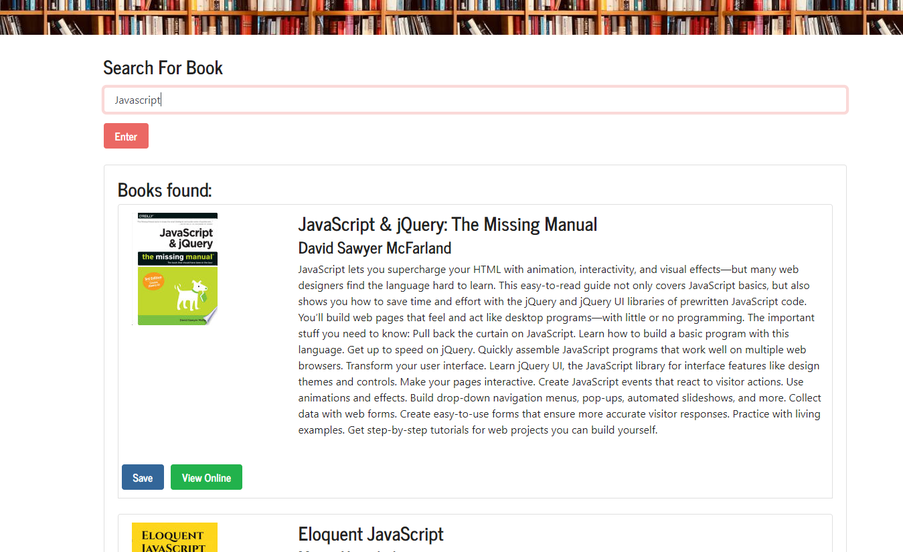
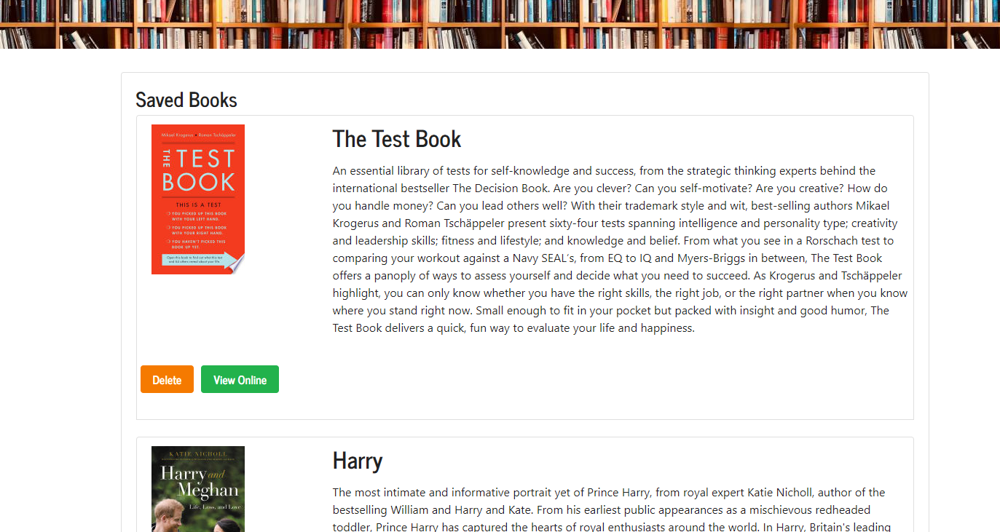

# React Book Search App

[Description](#description) 

[Ideal User](#ideal-user)

[Installation Instructions](#installation-instructions) 

[Site Overview](#site-overview) 
  

[Contribution Guidelines](#contribution-guidelines) 

[Tests](#tests) 
 
[Questions](#questions)

## Description
`
This is a full MERN stack application that is created using MongoDB, Express.js, React.js and Node.js.  Database management is done using Mongoose and the database is supported on Heroku via AtlasDB.  All styling is done via bootstrap classes with a few custom styles thrown in.  
`

`
This app utilizes the Google Books API to search for books, and provides a link to a hosted site where the user can read more about the book.  If they are interested in it, they can save it to their 'Saved Book' list where they have easy access to it.  
`
## Ideal User

`This application is aimed at a user who is looking to 
search for books that they might be interested in reading in the future
so they can store them and come back to them when they are ready to read them.
`
## Installation Instructions
`
No need to install this application! If you want to clone or fork it to your local device feel free, otherwise it is available via Heroku and can be found at the following link: https://calm-cove-92054.herokuapp.com/
`
## Site Overview

`
The search feature of this app uses Axios to make an API call to the Google Books API which in turn renders a list of 10 books that are displayed by the Search List component.  Each result, which is passed down as a prop, also comes with a button to read more about the book or save the book to the savedBooks page.  
`

`
The database management for this application is done using Mongoose and API calls with Axios.  Book models are defined in the models directory and created and required using custom functions.  
`

`
Once a books information is saved, it is then saved as a Book object using the create function that can be found in controllers/booksControllers.js.  It is then managed using the other functions provided on that file.  
`

`
They are then displayed on the SavedBooks page for the user to come back to when they are interested in finding more information or when they want to remove it from the list.  
`

## License

`
This application uses the MIT license.
`

## Contribution Guidelines
`
If you would like to contribute to this project feel free to send requests.  I only wish that you be respectful to other contributes and to the code itself and maintain good clean coding practices. 
`
### Questions
`
If you have any questions about the application, be sure to contact me at my [e-mail](mailto:smonagha@conncoll.edu).
`
`
Alternatively you can find me and my other works at my [Github account](https://github.com/seanmonaghan).
`